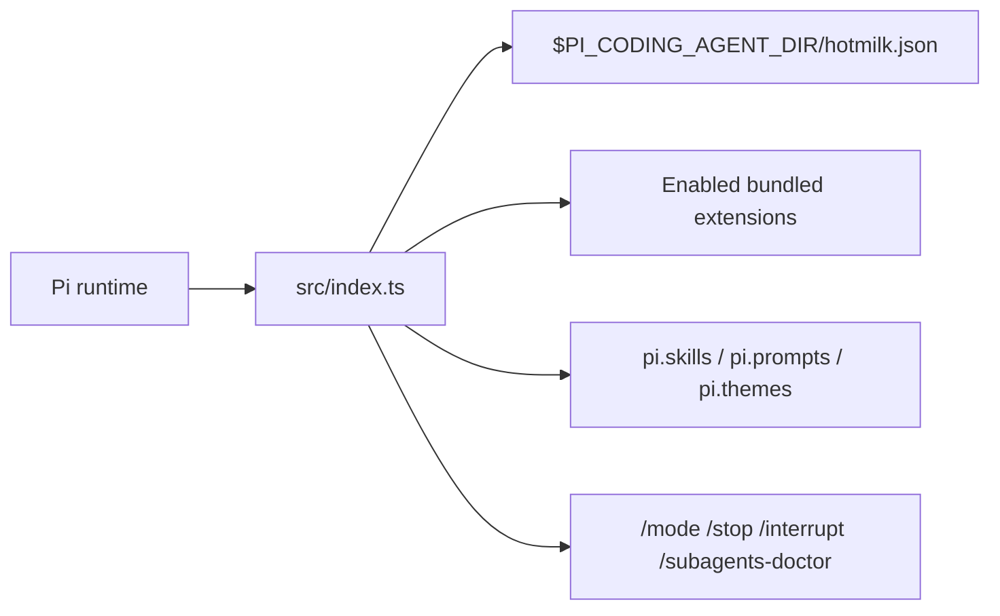
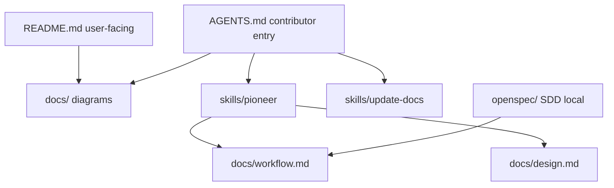

# hotmilk architecture

Diagrams for contributors. User-facing install and toggles stay in [README.md](../README.md). Commands and layout stay in [AGENTS.md](../AGENTS.md).

| File | Diagrams |
| ---- | -------- |
| [design.md](design.md) | Session startup, extension load order, config surfaces |
| [directory.md](directory.md) | Repo layout |
| [workflow.md](workflow.md) | Pioneer plan paths and OpenSpec SDD |
| [tech.md](tech.md) | Stack pins from `package.json` / CI |

`pi.skills` / `pi.prompts` / `pi.themes` come from `package.json` (always indexed). They are not gated by `/mode` toggles. `/subagents-doctor` registers only when `extensions.subagents` is on.

Defaults: [hotmilk.json](../hotmilk.json). Registry: `BUNDLED_EXTENSION_DEFINITIONS` in [src/config/bundled-extensions.ts](../src/config/bundled-extensions.ts).