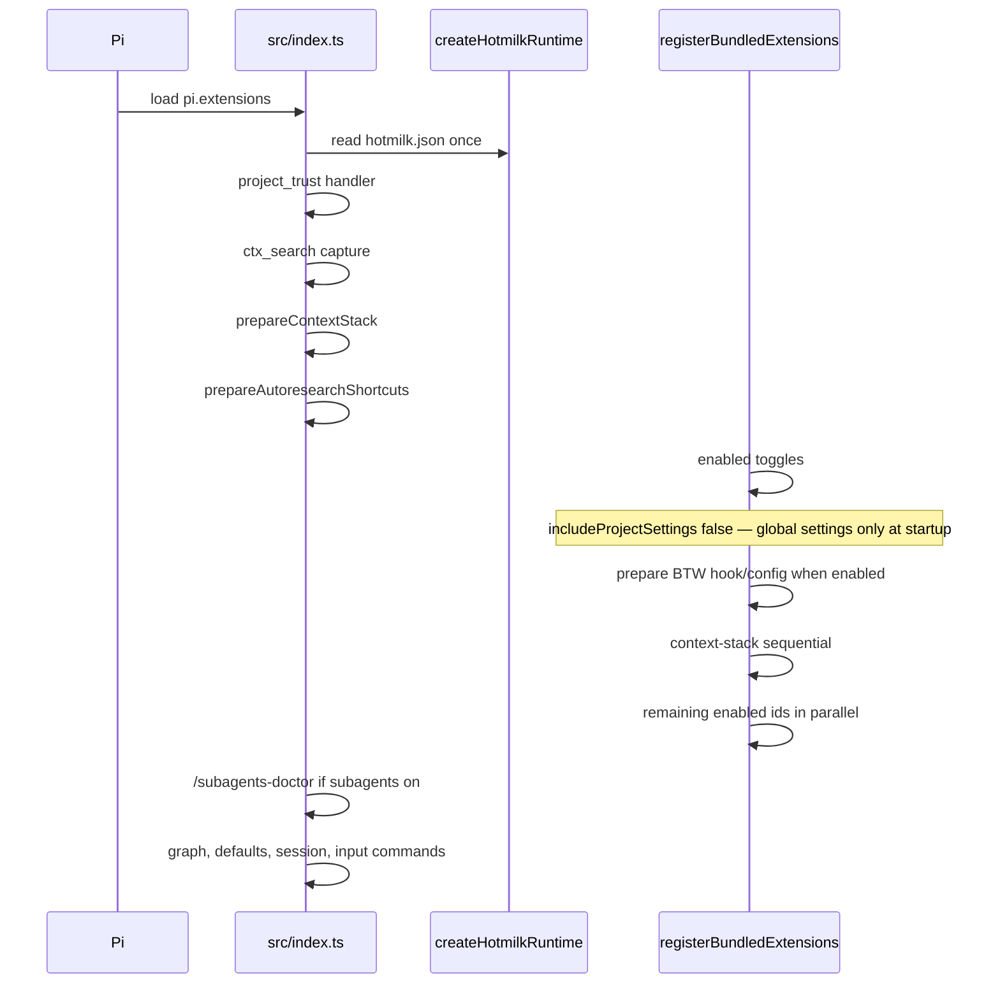
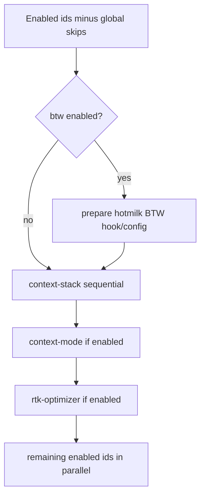

# Architecture

These rules apply when changing package layout, startup, bundled extensions, or configuration. Product scope: [requirements.md](requirements.md).

Source of truth: [src/index.ts](../src/index.ts), [src/bootstrap/extensions.ts](../src/bootstrap/extensions.ts), [src/config/bundled-extensions.ts](../src/config/bundled-extensions.ts), [hotmilk.json](../hotmilk.json).

## Package model

- hotmilk is a Pi meta-package. It bundles gentle-pi, context-mode, graphify, subagents, and related extensions.
- Pi loads only `./src/index.ts` from `package.json` → `pi.extensions`.
- Toggled bundles load lazily through `BUNDLED_EXTENSION_DEFINITIONS` and `src/bootstrap/extensions.ts`; do not add toggled packages directly to `pi.extensions`.
- Adding a bundle requires one registry row with its `defaultEnabled` flag, a `package.json` dependency, and README documentation.
- Keep the registry's normal package module path. Preserve an explicit pre-load hook only when an upstream package requires hotmilk integration before import, as with `pi-btw`.

## Session startup

Disabled toggles never call their loader.



## Extension load order

`loadPhase: "context-stack"` applies only to `context-mode` and `rtk-optimizer`, with `context-mode` first in the definition list. When BTW is enabled, hotmilk prepares its session hook and toggle config before registry loading. `pi-btw/extensions/btw.ts` then loads through the same registry path as every other bundle. Context-stack ids load sequentially. `Promise.all` loads the remaining enabled ids in parallel.



## Configuration and trust

- User config: `$PI_CODING_AGENT_DIR/hotmilk.json` (default `~/.pi/agent`); tests may set `HOTMILK_CONFIG_ROOT`.
- `/mode` edits persona and toggles; `/reload` applies them.
- `projectTrust` is handled by `src/bootstrap/project-trust.ts`.
- Before trust, startup deduplication scans global Pi settings only (`includeProjectSettings: false` in `src/index.ts`).
- Pi runs global-package extensions in the pre-trust pass and project packages after trust. When cwd is hotmilk itself and project settings reference the copy, the npm-installed copy yields to the project copy (`shouldYieldToProjectEntry` in `src/bootstrap/global-extension-sources.ts`); an installed release yields only once it carries the guard.
- In-repo, the yielding global copy skips `registerProjectTrustHandlers`, and the project copy loads after trust is resolved, so hotmilk's `projectTrust` modes do not apply and Pi's native trust prompt is used (same as the default `delegate`).
- `.agents/`, `graphify-out/`, and `openspec/` are gitignored runtime data, not package sources.

```mermaid
flowchart TB
  template["repo hotmilk.json seed template"] --> user["$PI_CODING_AGENT_DIR/hotmilk.json"]
  user --> runtime["createHotmilkRuntime()"]
  runtime --> toggles[extensionToggles]
  runtime --> trust[projectTrust]
  runtime --> graph[graph.warnOnStale]
  runtime --> defaults[defaults.persona]
  mode["/mode"] --> user
  user --> reload["/reload to apply extension changes"]
```

Pi and hotmilk resolve `$PI_CODING_AGENT_DIR` through `getAgentDir()`.

## Adding a bundled extension

1. Add the package to `package.json` `dependencies` (do not add `bundleDependencies`).
2. Add one row to `BUNDLED_EXTENSION_DEFINITIONS` (`id`, `packageName`, `module`, `group`, optional `loadPhase`).
3. Set its `defaultEnabled` flag in `BUNDLED_EXTENSION_DEFINITIONS`.
4. Document the toggle in [README.md](../README.md).

Do not append toggled packages to `pi.extensions`.

## Layout

Use [directory.md](directory.md) for module paths and the full tree.

## Recon

- graphify is on by default; shazam is off by default.
- Prefer graphify for architecture and relationship questions. Refresh it with `graphify update .` after code changes before relying on graph output.
