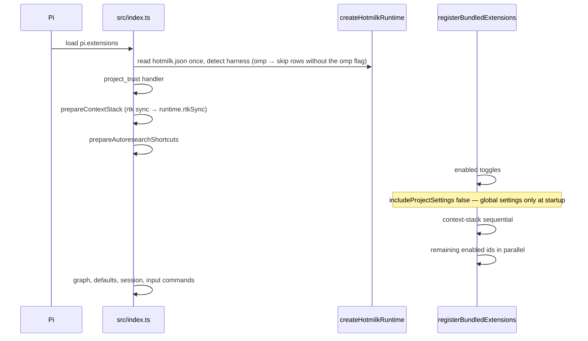
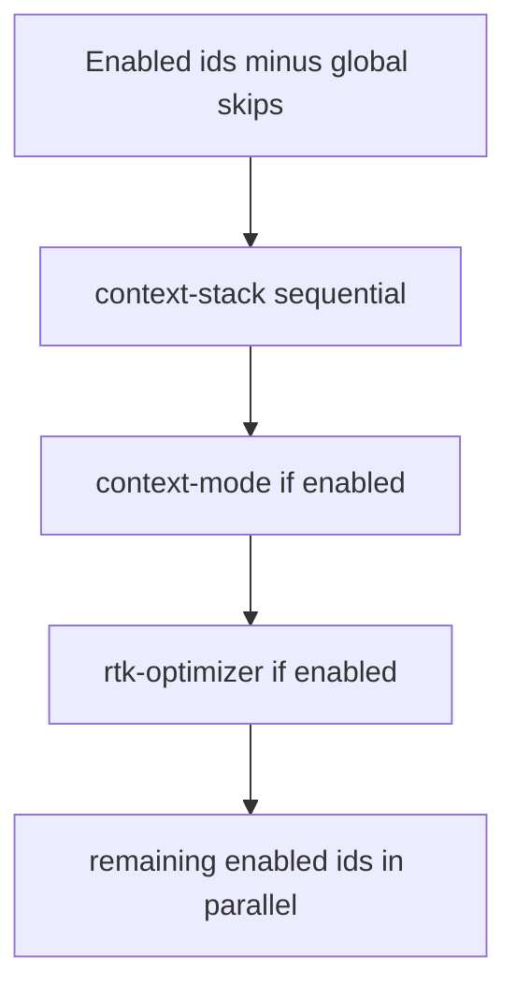

# Architecture

These rules apply when changing package layout, startup, bundled extensions, or configuration. Product scope: [requirements.md](requirements.md).

Source of truth: [src/index.ts](../src/index.ts), [src/bootstrap/extensions.ts](../src/bootstrap/extensions.ts), [src/config/bundled-extensions.ts](../src/config/bundled-extensions.ts), [hotmilk.json](../hotmilk.json).

## Package model

- hotmilk is a Pi meta-package. It bundles gentle-pi, context-mode, graphify, subagents, and related extensions.
- Pi loads only `./src/index.ts` from `package.json` → `pi.extensions`.
- Toggled bundles load lazily through `BUNDLED_EXTENSION_DEFINITIONS` and `src/bootstrap/extensions.ts`; do not add toggled packages directly to `pi.extensions`.
- Adding a bundle requires one registry row with its `defaultEnabled` flag, a `package.json` dependency, and README documentation.
- Keep the registry's normal package module path. Add a pre-load hook only when an upstream package requires hotmilk integration before import; none does today.

## Session startup

Disabled toggles never call their loader.

`createHotmilkRuntime` also detects the host harness from `CONFIG_DIR_NAME` in `@earendil-works/pi-coding-agent` (`.pi` = pi; `.omp` = omp, which rewrites that import onto its own host). Under omp only rows flagged `omp: true` in the registry (`OMP_SUPPORTED_IDS`) load, each through a literal import specifier in `src/bootstrap/omp-loaders.js` (omp rewrites Pi imports only in modules its static analyzer can reach, and it cannot follow the computed `file://` URLs the Pi loader uses); other enabled toggles are cleared into `harnessSkips` and reported at session start, and `/mode` labels them `(pi only)`. omp resolves host imports only inside hotmilk's own module graph, so a row loaded any other way fails on `@earendil-works/*` / `typebox`, and one failure would abort hotmilk. `bun run audit:omp` ([scripts/omp-audit.ts](../scripts/omp-audit.ts)) loads each row alone under the local omp with gating off (`HOTMILK_OMP_UNGATED=1`), diffs its slash commands against an all-off baseline, and fails when a flag disagrees; CI job `omp-audit` runs it against the release pinned as `OMP_AUDITED_VERSION` and blocks publish on a mismatch. Contract: [bundles.md](bundles.md#omp-support). hotmilk-owned handlers and commands still register. OpenClaw never loads hotmilk (it reads only `openclaw.extensions`).

```mermaid
sequenceDiagram
  participant Pi
  participant Index as src/index.ts
  participant Runtime as createHotmilkRuntime
  participant Ext as registerBundledExtensions
  Pi->>Index: load pi.extensions
  Index->>Runtime: read hotmilk.json once, detect harness (omp → skip rows without the omp flag)
  Index->>Index: project_trust handler
  Index->>Index: prepareContextStack (rtk sync → runtime.rtkSync)
  Index->>Index: prepareAutoresearchShortcuts
  Ext->>Ext: enabled toggles
  Note over Ext: includeProjectSettings false — global settings only at startup
  Ext->>Ext: context-stack sequential
  Ext->>Ext: remaining enabled ids in parallel
  Index->>Index: graph, defaults, session, input commands
```

## Extension load order

`loadPhase: "context-stack"` applies only to `context-mode` and `rtk-optimizer`, with `context-mode` first in the definition list. Context-stack ids load sequentially. `Promise.all` loads the remaining enabled ids in parallel.

```mermaid
flowchart TD
  enabled[Enabled ids minus global skips] --> stack["context-stack sequential"]
  stack --> cm["context-mode if enabled"]
  cm --> rtk["rtk-optimizer if enabled"]
  rtk --> parallel["remaining enabled ids in parallel"]
```

## Configuration and trust

- User config: `$PI_CODING_AGENT_DIR/hotmilk.json` (default `~/.pi/agent`; under omp, omp's agent dir, default `~/.omp/agent`); tests may set `HOTMILK_CONFIG_ROOT`.
- `/mode` edits persona and toggles; `/reload` applies them.
- `projectTrust` is handled by `src/bootstrap/project-trust.ts`.
- Before trust, startup deduplication scans global Pi settings only (fixed inside `registerBundledExtensions` in `src/bootstrap/extensions.ts`).
- Pi runs global-package extensions in the pre-trust pass and project packages after trust. When cwd is hotmilk itself and project settings reference the copy, the npm-installed copy yields to the project copy (`shouldYieldToProjectEntry` in `src/bootstrap/global-extension-sources.ts`); an installed release yields only once it carries the guard.
- In-repo, the yielding global copy skips `registerProjectTrustHandlers`, and the project copy loads after trust is resolved, so hotmilk's `projectTrust` modes do not apply and Pi's native trust prompt is used (same as the default `delegate`).
- `.agents/` and `graphify-out/` are gitignored runtime data, not package sources.

```mermaid
flowchart TB
  template["repo hotmilk.json seed template"] --> user["$PI_CODING_AGENT_DIR/hotmilk.json"]
  user --> runtime["createHotmilkRuntime()"]
  runtime --> toggles[extensionToggles]
  runtime --> trust[projectTrust]
  runtime --> graph[graph.warnOnStale]
  runtime --> defaults[defaults.persona]
  mode["/mode"] --> user
  user --> reload["/reload to apply extension changes"]
```

Pi and hotmilk resolve `$PI_CODING_AGENT_DIR` through `getAgentDir()`.

## Adding a bundled extension

1. Add the package to `package.json` `dependencies` (do not add `bundleDependencies`).
2. Add one row to `BUNDLED_EXTENSION_DEFINITIONS` (`id`, `packageName`, `module`, `group`, optional `loadPhase`).
3. Leave `defaultEnabled` unset: every row ships default off ([bundles.md](bundles.md#adding-a-row)).
4. Document the toggle in [README.md](../README.md), then finish the rest of the checklist in [bundles.md](bundles.md#adding-a-row): table line, `omp-loaders.js` entry, `audit:omp`.

Do not append toggled packages to `pi.extensions`.

## Layout

Use [directory.md](directory.md) for module paths and the full tree.

## Recon

- graphify and shazam are off by default, like every bundled row; enable them in `/mode`.
- Prefer graphify for architecture and relationship questions. Refresh it with `graphify update .` after code changes before relying on graph output.
