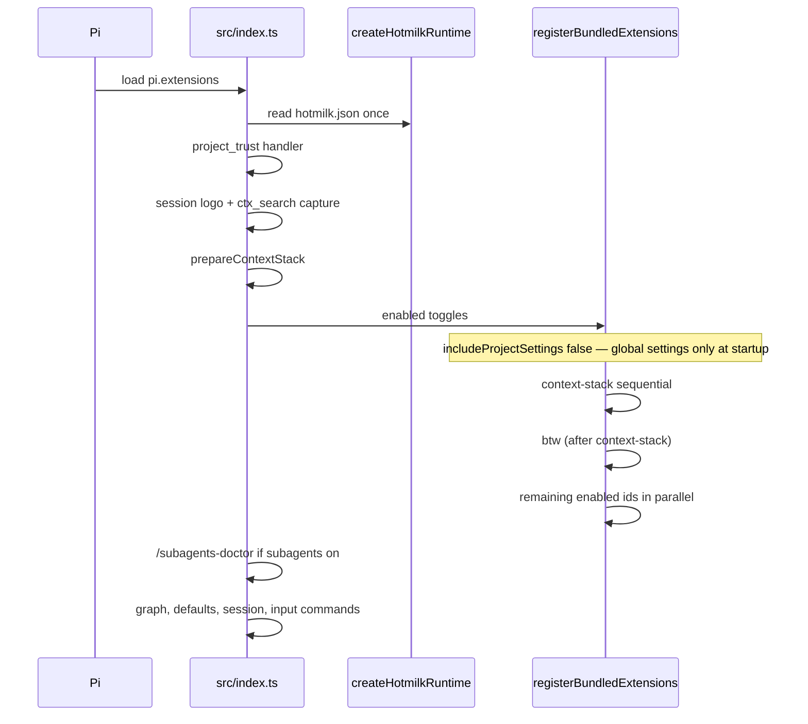
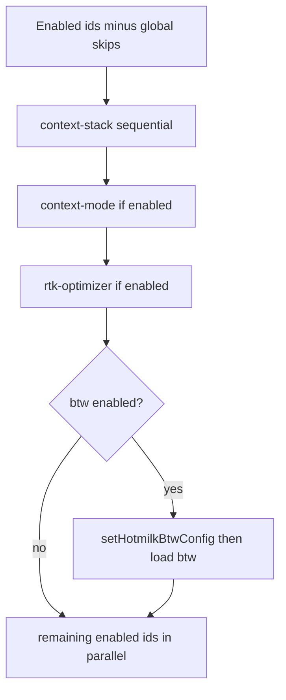

# Design

Source of truth: [src/index.ts](../src/index.ts), [src/bootstrap/extensions.ts](../src/bootstrap/extensions.ts), [src/config/bundled-extensions.ts](../src/config/bundled-extensions.ts), [hotmilk.json](../hotmilk.json).

## Session startup

Only `./src/index.ts` is listed in `package.json` → `pi.extensions`. Disabled toggles never call their loader.



## Extension load order

`loadPhase: "context-stack"` is only on `context-mode` and `rtk-optimizer` (definition order: context-mode first). Disabled stack ids are skipped. `btw` loads after the stack so `setHotmilkBtwConfig` runs first. Everything else enabled loads with `Promise.all`.



## Config surfaces

```mermaid
flowchart TB
  template["repo hotmilk.json seed template"] --> user["$PI_CODING_AGENT_DIR/hotmilk.json"]
  user --> runtime["createHotmilkRuntime()"]
  runtime --> toggles[extensionToggles]
  runtime --> trust[projectTrust]
  runtime --> graph[graph.warnOnStale]
  runtime --> mcp[mcp.seedOnStart]
  runtime --> defaults[defaults.persona]
  mode["/mode"] --> user
  user --> reload["/reload to apply extension changes"]
```

`HOTMILK_CONFIG_ROOT` overrides the config dir for tests. Production uses `PI_CODING_AGENT_DIR` (same as Pi `getAgentDir()`; default `~/.pi/agent`).

## Adding a bundled extension

1. `package.json` `dependencies` (do not add `bundleDependencies`).
2. One row in `BUNDLED_EXTENSION_DEFINITIONS` (`id`, `package`, `module`, `group`, optional `loadPhase`).
3. Default in repo `hotmilk.json`.
4. Document the toggle in [README.md](../README.md).

Do not append toggled packages to `pi.extensions`.