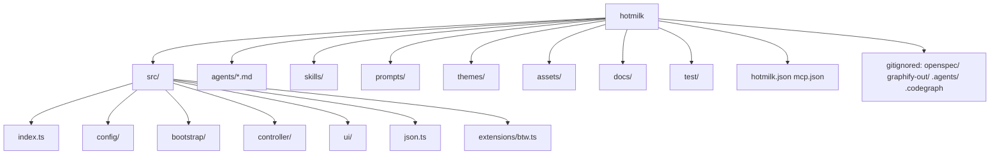

# Directory

On-disk layout for this repo. Gitignored runtime dirs are listed so agents do not treat them as package sources.

| Path | Role |
| ---- | ---- |
| `src/index.ts` | Pi extension entry |
| `src/config/` | `hotmilk.json` I/O, resolve, `createHotmilkRuntime()`, bundled registry |
| `src/bootstrap/` | Registration, session, graph, defaults, BTW, project trust, `/subagents-doctor` |
| `src/controller/` | `/mode`, `/stop`, `/interrupt` |
| `src/ui/` | Footer, session logo |
| `src/json.ts` | Shared JSON parse/type helpers |
| `src/extensions/btw.ts` | hotmilk BTW module path used by the bundled `btw` row |
| `agents/` | Package-canonical subagent prompts; copy to `.pi/agents/` for discovery |
| `skills/` | First-party skills (`pioneer`, `update-docs`, `make-docs`, `recommend-research`) |
| `assets/` | Package images (`pi.image`) |
| `docs/` | Architecture diagrams |
| `hotmilk.json` | Default toggle template shipped in the npm package |
| `mcp.json` | MCP server template for local projects |
| `openspec/` | Local SDD artifacts (gitignored; not in the npm tarball) |
| `graphify-out/` | Graphify index (gitignored) |
