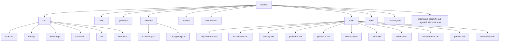

# Directory

This repo's on-disk layout. Gitignored runtime directories are included so agents do not mistake them for package sources.

```mermaid
flowchart TB
  root[hotmilk]
  root --> src[src/]
  src --> index[index.ts]
  src --> config[config/]
  src --> bootstrap[bootstrap/]
  src --> controller[controller/]
  src --> ui[ui/]
  src --> bundled[bundled/]
  root --> skills[skills/]
  root --> prompts[prompts/]
  root --> themes[themes/]
  themes --> themesMonokai["monokai.json"]
  themes --> themesKanagawa["kanagawa.json"]
  root --> assets[assets/]
  root --> designMd["DESIGN.md"]
  root --> docs[docs/]
  docs --> docsRequirements["requirements.md"]
  docs --> docsArchitecture["architecture.md"]
  docs --> docsTesting["testing.md"]
  docs --> docsProblems["problems.md"]
  docs --> docsGuidance["guidance.md"]
  docs --> docsDirectory["directory.md"]
  docs --> docsTech["tech.md"]
  docs --> docsSecurity["security.md"]
  docs --> docsMaintenance["maintenance.md"]
  docs --> docsPattern["pattern.md"]
  docs --> docsReferences["references.md"]
  root --> test[test/]
  root --> tmpl["hotmilk.json"]
  root --> gitig["gitignored: graphify-out/ .agents/ .atl/ odd/ .env"]
```

| Path | Role |
| ---- | ---- |
| `src/index.ts` | Pi extension entry |
| `src/config/` | `hotmilk.json` I/O, resolve helpers, `createHotmilkRuntime()`, bundled registry |
| `src/bootstrap/` | Registration, session, graph, defaults, project trust, bundled module types (`extension-module.ts`), JSON helpers (`json.ts`) |
| `src/controller/` | `/mode`, `/stop`, `/interrupt` |
| `src/ui/` | Footer, startup intro (`logo.ts`) |
| `src/bundled/` | Vendored kanagawa theme + extension (MIT, from pi-kanagawa; `/thinking` command removed, `@thinking:` interceptor updated to the Pi `InputEvent` contract) |
| `src/bootstrap/omp-loaders.js` | Literal-specifier bundle loaders used under omp (plain JS; types in `omp-loaders.d.ts`) |
| `src/bootstrap/personas.md` | Persona prose (`## gyal`, `## raiden`) injected for `defaults.persona`; `defaults.ts` selects a section |
| `skills/` | First-party skills (`pioneer`, `comfortzone`) |
| `scripts/` | Local maintenance scripts (`omp-audit.ts` → `bun run audit:omp`); not shipped. Kept out of `tools/`, which omp scans for custom tools |
| `assets/` | Package images (`pi.image`) |
| `DESIGN.md` | TUI behavior (footer, `/mode`, commands, trust) and color usage |
| `themes/monokai.json` | Shipped Pi theme file (runtime color source) |
| `themes/kanagawa.json` | Vendored theme for the `kanagawa` toggle (from pi-kanagawa, MIT) |
| `docs/` | Intent: requirements, architecture, testing, problems, guidance, … |
| `hotmilk.json` | Default config template for graph, persona, language, and trust |
| `graphify-out/` | Graphify index (gitignored) |
