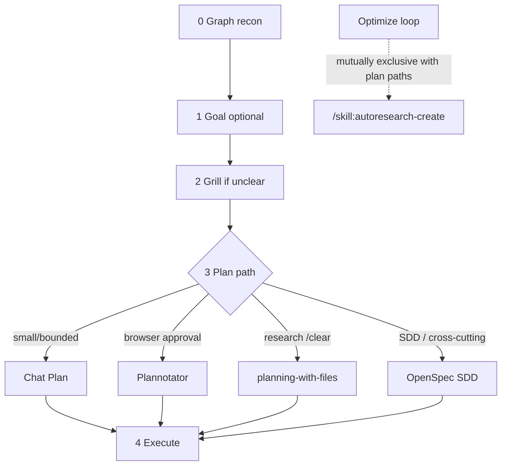
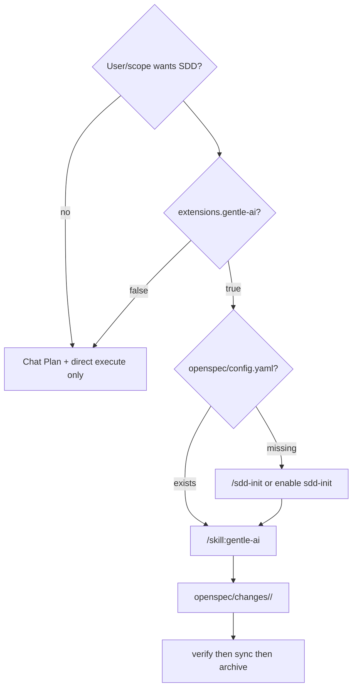
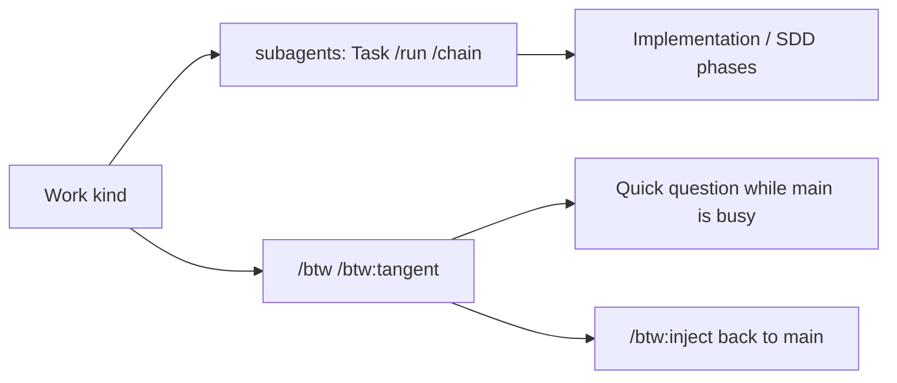

# Workflow

Pioneer routing: [skills/pioneer/SKILL.md](../skills/pioneer/SKILL.md). OpenSpec gate: [skills/pioneer/references/openspec-routing.md](../skills/pioneer/references/openspec-routing.md). One plan authority per task.

## Pioneer phases

`observational-memory` and `shazam` are not plan paths. OM is compaction continuity (default off). Shazam is execute-time impact/verify (default off).

## OpenSpec vs Chat Plan

`extensions.gentle-ai` must be **true** for OpenSpec SDD (`/skill:gentle-ai`, `/sdd-*`).

Do not mix chat `Plan:` and OpenSpec artifacts for the same change unless the user asks for a sketch first. If gentle-ai drops mid-SDD, stop apply/verify/sync — do not downgrade to Chat Plan. See openspec-routing **Mid-flow recovery**.

## Subagents vs BTW

Both default **on**. They do not share command names.

Verify project agents with `/subagents-doctor` when `subagents` is on.
