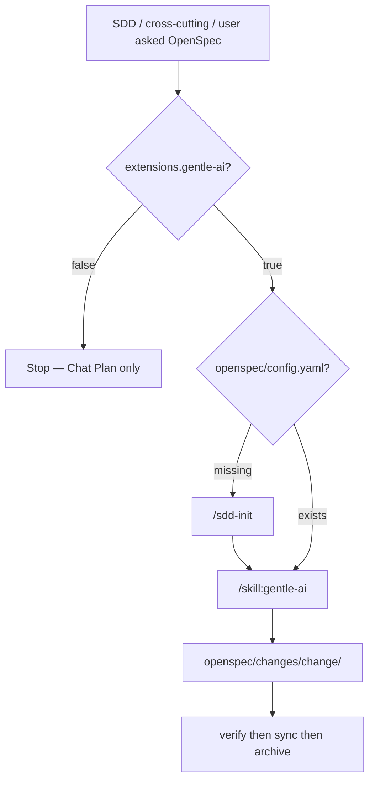

# OpenSpec / SDD routing

**Load when:** Plan routing chose **OpenSpec SDD** (Phase 3b) or Phase 4 OpenSpec execute.

**Do NOT load when:** Chat Plan path is chosen — use [`chat-plan.md`](chat-plan.md) instead.

**Primary skill — MANDATORY:** load **`/skill:gentle-ai`** for phase chain, `/sdd-status`, `/sdd-continue`, preflight, delegation, and verify/sync/archive rules. This file is a pioneer gate only — not a second copy of gentle-ai.

Diagrams: [`docs/workflow.md`](../../../docs/workflow.md).

## Pre-SDD checklist (pioneer gate)

Before proposal/spec work, confirm via **`/skill:gentle-ai`**:

| Gate              | Check                                                                                                    |
| ----------------- | -------------------------------------------------------------------------------------------------------- |
| Session preflight | SDD preflight choices captured this session (execution mode, artifact store, PR strategy, review budget) |
| Init guard        | `openspec/config.yaml` exists or `/sdd-init` runs first                                                  |
| Toggle            | `extensions.gentle-ai: true` — if off, **stop**; Chat Plan only                                          |

`extensions.openspec-pi` (default **false**) adds official `/opsx-*` skills/prompts. It complements gentle-ai SDD; it is **not** a second plan path and does not replace `/skill:gentle-ai`.

## Gate

If `openspec/config.yaml` is missing, run **`/sdd-init`** (or enable `sdd-init` in `/mode`) before proposal/spec work.

## Artifacts

Artifacts live under `openspec/changes/<change>/`. This repo gitignores `openspec/` — local SDD files are not in the npm tarball. See **`/skill:gentle-ai`** for phase chain and file roles.

## Grill → OpenSpec

Grill output (`## Proposed CONTEXT.md`, `## Proposed ADR`) feeds proposal/design — sync into OpenSpec artifacts, not only chat.

## Pioneer NEVER

- Do not skip **verify** or **sync** because chat plan "looks done".
- Do not mix chat `Plan:` and OpenSpec artifacts for the same change unless the user explicitly wants a sketch first.
- Do not downgrade an **active** OpenSpec change to Chat Plan when gentle-ai becomes unavailable mid-flow.
- Do not treat `openspec-pi` `/opsx-*` as a replacement for gentle-ai SDD gates.

## Mid-flow recovery (gentle-ai lost during SDD)

Triggers: `/mode` disables `extensions.gentle-ai`, gentle-ai skill missing after SDD artifacts exist, or `/sdd-continue` fails because SDD runtime is gone.

| Step | Action                                                                                                                                                                                                                           |
| ---- | -------------------------------------------------------------------------------------------------------------------------------------------------------------------------------------------------------------------------------- |
| 1    | **Stop** apply/verify/sync/archive — do not emit chat `Plan:` for the same change                                                                                                                                                |
| 2    | Tell user: _"OpenSpec change `<change>` is in progress. SDD requires gentle-ai. Enable `extensions.gentle-ai`, `/reload`, then `/sdd-status` and `/sdd-continue` — do not switch to Chat Plan or you will lose artifact gates."_ |
| 3    | Preserve artifacts under `openspec/changes/<change>/`; note last completed phase in chat                                                                                                                                         |
| 4    | Resume only via **`/skill:gentle-ai`** (`/sdd-status` → `/sdd-continue`) after gentle-ai is back                                                                                                                                 |

**Forbidden:** abandoning SDD artifacts, re-planning the same scope in chat, or implementing without verify/sync because gentle-ai dropped.

After large code changes, mention `graphify update .` if the project uses graphify.
